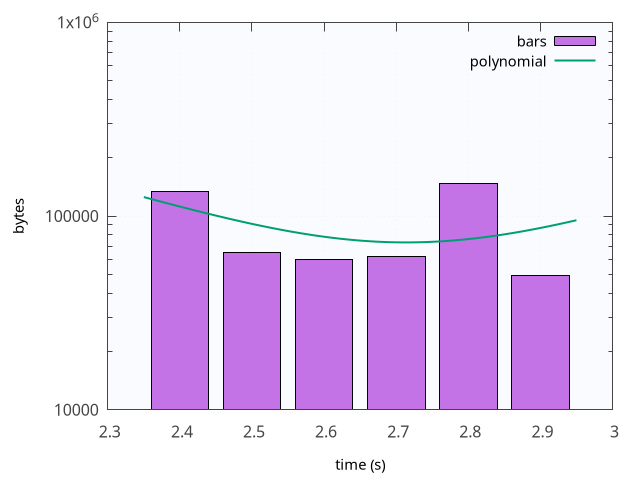

# getbar

`getbar` は HTTP/HTTPS GET（libcurl）で URL をダウンロードし、標準出力に
**バーシリーズ**を記録します。ブロックごとの受信時間、または時間スライスごとの
受信バイト数です。任意の多項式フィット、スループット推定、gnuplot チャートにより、
ミラー、CDN、直リンクのダウンロード速度のベンチマークに適しています。

```bash
getbar [OPTION]... URL
```

**ブロックモード**（`-b`）または **インターバルモード**（`-i`）のいずれかが必須です。

## 他言語

| 言語 | README |
|------|--------|
| English | [README.md](README.md) |
| 简体中文 | [README-zh_CN.md](README-zh_CN.md) |
| 繁體中文 | [README-zh_TW.md](README-zh_TW.md) |
| 日本語 | README-ja.md（このファイル） |
| 한국어 | [README-ko.md](README-ko.md) |
| ไทย | [README-th.md](README-th.md) |
| Tiếng Việt | [README-vi.md](README-vi.md) |
| Français | [README-fr.md](README-fr.md) |
| Deutsch | [README-de.md](README-de.md) |
| Italiano | [README-it.md](README-it.md) |
| Esperanto | [README-eo.md](README-eo.md) |

## 出力

### ブロックモード（`-b`）

値は **マイクロ秒** で、1 行にスペース区切りで出力されます。

| 位置 | 意味 |
|------|------|
| 最初の値 | 最初のバイトが到着するまでの待ち時間（TTFB） |
| 以降の値 | `-b` バイトの各ブロックを受信するのにかかった時間 |

例：

```text
245000 1200 980 1100 1050
```

### インターバルモード（`-i`）

値は各時間スライスで **受信したバイト数** で、1 行にスペース区切りで出力されます。
先頭の `0` は、そのスライスでまだデータが届いていないことを示します（接続やサーバーの遅延）。

例：

```text
0 0 0 0 65536 131072 65536
```

シリーズ行の後に、追加行が出力される場合があります：

- **多項式**（`-p`）：`offset coef_n … coef_0`（offset の後に高次から低次の係数）
- **推定**（`-e`）：データ開始後のある時点から終了までの平均バイト/秒

`-q` を使うとシリーズを抑制し、追加行のみを出力します。

転送の終了は、ダウンロード完了、`-w` / `--window` の期限切れ、`-s` / `--size-max` 到達、
またはリクエスト失敗のいずれかです。

インターバルモードでは、EOF 後の末尾のゼロバケットは破棄されます（最後の不完全な
スライスを保持するため、約 0.1 s の猶予があります）。

## オプション

| オプション | 説明 |
|------------|------|
| `-b`, `--block-size=NUM[kmgKMG]` | ブロックモードのブロックサイズ |
| `-i`, `--interval=NUM[um][s]` | インターバルモードのスライス長；`NUM` は小数可（`0.1s`、`100.5ms` など） |
| `-s`, `--size-max=NUM[kmgKMG]` | `NUM` バイト受信後に停止 |
| `-w`, `--window=NUM[um][s]` | 時間制限後に停止 |
| `-p`, `--polynomial=ORDER` | 多項式をフィット（次数 0–7）し、offset と係数を出力 |
| `-g`, `--gnuplot=FILE` | チャートまたは gnuplot スクリプトを書き出す（下記参照） |
| `-f`, `--force` | 既存の gnuplot 出力ファイルを上書き |
| `-e`, `--estimate-bps=NUM[um][s]` | データ開始後 `NUM` 時点からバイト/秒を推定して出力 |
| `-v`, `--verbose` | stderr に URL とバイト数をログ出力 |
| `-q`, `--quiet` | stdout にバーシリーズを出力しない |
| `-h`, `--help` | ヘルプ |
| `--version` | バージョン |

### サイズ接尾辞（`-b`、`-s`）

`k`/`m`/`g`/`t`（1024 進）または `K`/`M`/`G`/`T`（1000 進）。例：`64k`、`10M`。

### 時間接尾辞（`-i`、`-w`、`-e`）

| 接尾辞 | 意味 |
|--------|------|
| （なし） | 秒 |
| `ms` または `m` | ミリ秒 |
| `us` または `u` | マイクロ秒 |
| `s` | 秒（明示） |

接尾辞なしの数値は秒がデフォルトです。例：`100ms`、`0.1s`、`0.1`、`500us`。

### 短いオプション

複数の短いオプションをまとめて書けます。**値は最後の文字にだけ** 付けられます：

```bash
getbar -vfw3 -i100ms https://example.com/file
# 次と同じ：-v -f -w3 -i100ms
```

2 つの引数付きオプションを 1 つのクラスタにまとめないでください（別々に指定します）。

## 多項式フィット（`-p`）

**offset** は有効データが始まる前のアイドル期間です：

- **インターバルモード**：アイドル時間（秒）。先頭のゼロスライス数 × インターバル。
- **ブロックモード**：TTFB バーの後、継続時間がゼロのブロック数。

係数はシリーズの非アイドル部分への多項式フィットを表します。
`-g` と組み合わせると、曲線がチャートに描画されます。

## Gnuplot 出力（`-g`）

| 拡張子 | 動作 |
|--------|------|
| `.png`、`.svg`、`.pdf`、`.eps` | `gnuplot` でレンダリング（要インストール） |
| その他 | gnuplot スクリプトのみ（`gnuplot` 不要） |

チャートはシリーズを棒グラフで表示します。多項式 **offset** より前のアイドルバケットは
プロットから除外され、有効な転送区間に焦点を当てます。
`-p` 指定時は、フィットした多項式が線で重ねられます。

例（インターバルモード + 多項式オーバーレイ）：



任意のテーマ：`share/getbar/gnuplot.rc.example` を
`$XDG_CONFIG_HOME/getbar/gnuplot.rc`
（または `~/.config/getbar/gnuplot.rc`）にコピーします。

## 例

### 基本的な測定

64 KiB ブロックごとのタイミング：

```bash
getbar -b 64k https://example.com/file
```

100 ms スライス、データ開始 1 s 後に速度を推定、シリーズ非表示：

```bash
getbar -i 100ms -e 1s -q https://example.com/file
```

ブロックモードの最初のフィールドから time-to-first-byte（マイクロ秒）を読み取る：

```bash
getbar -b 64k -s 256k https://example.com/file | awk '{print $1}'
```

### ダウンロード量または時間の制御

10 MiB のみ取得し、定常状態の速度推定を出力（ミラー測定向け）：

```bash
getbar -i 100ms -s 10M -e 2s -q https://mirror.example/file
```

ファイルサイズに関係なく最大 30 s 実行（ソークテスト / CDN エッジ）：

```bash
getbar -i 1s -w 30s -v https://cdn.example/large.bin
```

バイト数と時間の両方を制限 — 先に達した方で停止：

```bash
getbar -b 1M -s 50M -w 60s https://example.com/file
```

### チャートと分析

小数インターバル、3 秒上限、詳細ログ、チャートの強制上書き：

```bash
getbar -vfw3 -i0.1s -g /tmp/getbar.png -f https://example.com/file
```

ブロックチャートに二次多項式オーバーレイ：

```bash
getbar -b 64k -p 2 -g /tmp/getbar.png https://example.com/file
```

インターバルチャートに多項式（上記のサンプル図と同じ）：

```bash
getbar -i 100ms -p 2 -g chart.png -f https://example.com/file
```

レポートや Wiki 用に SVG をエクスポート：

```bash
getbar -i 200ms -p 2 -g report.svg -f https://example.com/file
```

後で編集する gnuplot スクリプトを保存（実行時に `gnuplot` 不要）：

```bash
getbar -b 64k -g /tmp/getbar.gp https://example.com/file
gnuplot /tmp/getbar.gp
```

### ミラーや URL の比較

各 URL で 5 MiB を取得し、推定 B/s を 1 行ずつ出力：

```bash
for url in https://mirror-a.example/file https://mirror-b.example/file; do
  printf '%s\t' "$url"
  getbar -i 100ms -s 5M -e 1s -q "$url"
done
```

推定スループットでミラーをソート：

```bash
while read -r url; do
  bps=$(getbar -i 100ms -s 5M -e 1s -q "$url") || continue
  printf '%s\t%s\n' "$bps" "$url"
done < mirrors.txt | sort -nr
```

### シェル連携

stderr に詳細ログを出力し、stdout は機械可読のままにする：

```bash
getbar -v -i 100ms -s 10M https://example.com/file > series.txt
```

1 回の実行でシリーズとチャートを保存：

```bash
getbar -i 100ms -s 20M -g run.png -f https://example.com/file | tee series.txt
```

推定行からおおよその MiB/s を算出：

```bash
bps=$(getbar -i 100ms -s 10M -e 1s -q https://example.com/file)
awk -v b="$bps" 'BEGIN { printf "~ %.2f MiB/s\n", b / 1024 / 1024 }'
```

## 依存関係

- **必須**：libcurl
- **推奨**：gnuplot（`-g` による画像出力時）
- 詳細は `getbar(1)` マニュアルページを参照。

## 関連

- `getbar(1)` — マニュアルページ
- `share/getbar/gnuplot.rc.example` — チャートテーマの例
